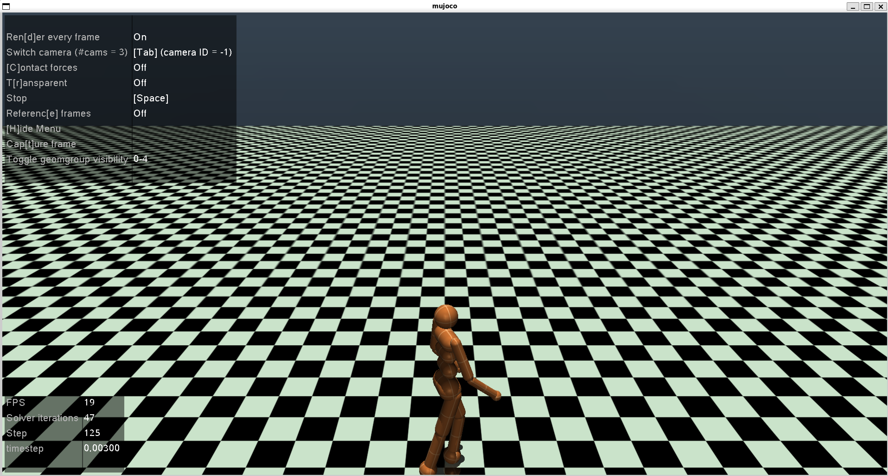
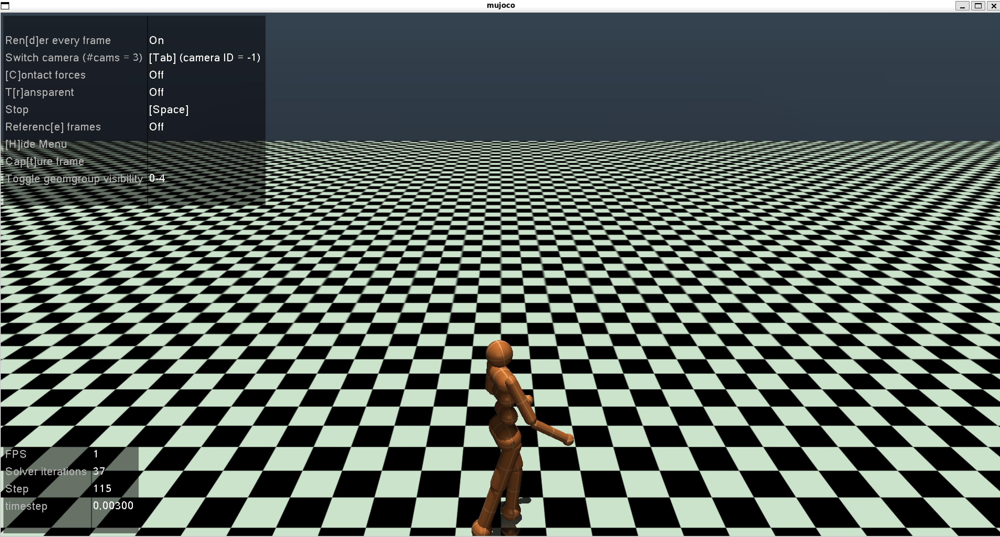
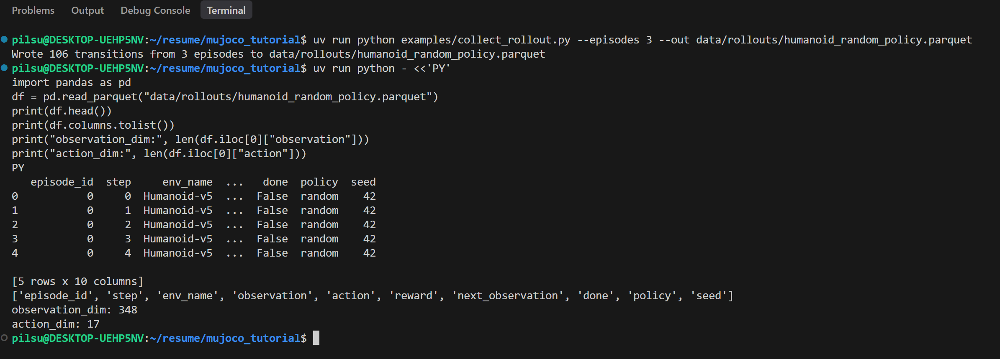
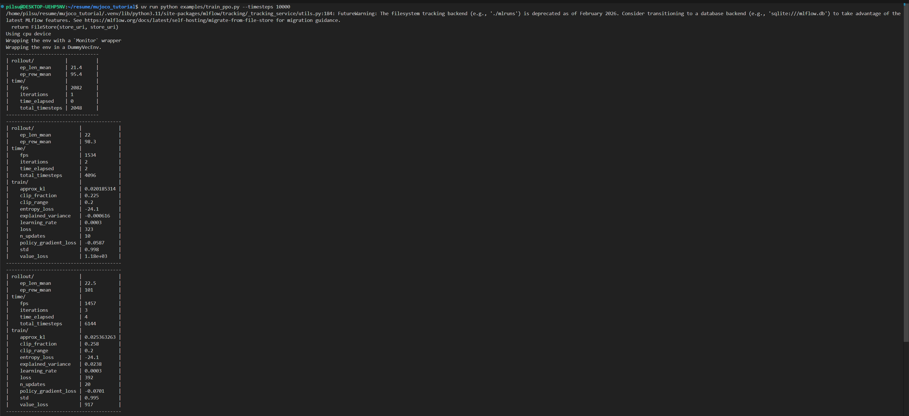
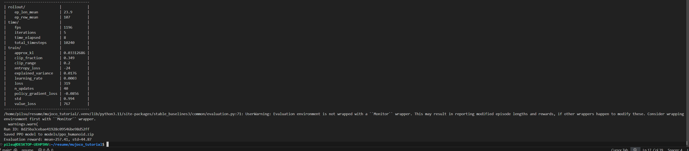
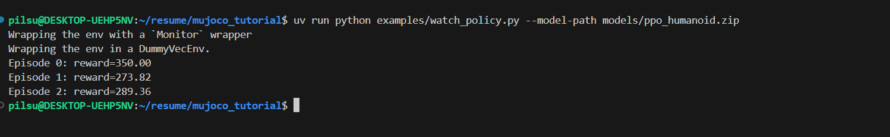
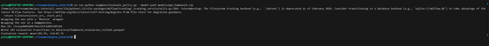
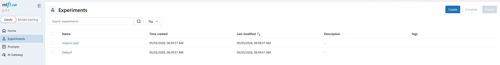
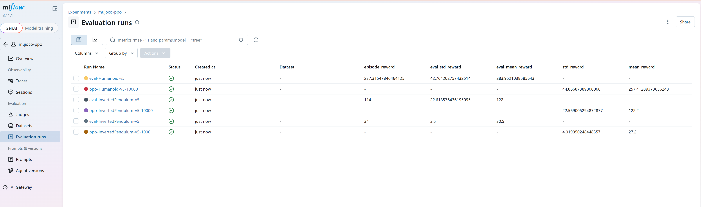

# MuJoCo Humanoid RL MLOps Tutorial

WSL2/WSLg 환경에서 `Humanoid-v5` 기반 synthetic robot telemetry를 수집하고, Stable-Baselines3 PPO 학습과 MLflow 실험 추적까지 연결한 최소 RL MLOps 튜토리얼입니다.

핵심 목표는 MuJoCo 휴머노이드가 **넘어지지 않고 균형을 유지하며 앞으로 이동하는 policy**를 학습하는 과정을 데이터/모델/실험 추적 관점으로 정리하는 것입니다.

## Overview

```text
MuJoCo Humanoid-v5
→ rollout trajectory collection
→ Parquet dataset
→ PPO training
→ policy evaluation
→ MuJoCo viewer validation
→ MLflow experiment tracking
```



## What This Project Shows

- `Humanoid-v5` 전신 3D 로봇 환경에서 timestep 단위 transition 데이터 수집
- `observation/action/reward/next_observation/done` schema를 Parquet dataset으로 저장
- Stable-Baselines3 PPO로 휴머노이드 locomotion policy 학습
- 학습된 policy를 MuJoCo viewer에서 직접 재생
- MLflow로 hyperparameter, reward metric, model/evaluation artifact 추적

## Screenshots

### Humanoid Simulation




### Rollout Dataset



### PPO Training





### Policy Evaluation





### MLflow Tracking





## Prerequisites
### MuJoCo 설치
MuJoCo는 Python 패키지(mujoco)로 설치되며, 별도의 라이선스 없이 사용할 수 있습니다.
```bash
pip install mujoco
```
또는 이 프로젝트는 uv를 사용하므로 uv sync 시 자동으로 설치됩니다.
WSL2/WSLg 환경에서 GUI viewer를 사용하려면 아래 Ubuntu 패키지가 필요합니다.
```bash
sudo apt update
sudo apt install -y libgl1 libglfw3 libglew2.2 libosmesa6
```
headless 렌더링(GUI 없이 rollout 수집)만 사용하는 경우에는 libosmesa6만 있으면 충분합니다.

### uv 설치
패키지 관리는 uv를 사용합니다. 설치되어 있지 않다면 아래 명령으로 설치합니다.
```bash
curl -LsSf https://astral.sh/uv/install.sh | sh
```
### Python 버전
Python 3.10 이상을 권장합니다

## Setup

```bash
cd ~/resume/mujoco_tutorial
uv venv
source .venv/bin/activate
uv sync
```

## WSL GUI Check

```bash
uv run python scripts/check_wsl_gui.py
```

`DISPLAY=:0`, `WAYLAND_DISPLAY=wayland-0`처럼 값이 있으면 WSLg GUI를 사용할 가능성이 높습니다.

## Run GUI Viewer

```bash
uv run python examples/gui_viewer.py
```

GUI가 뜨지 않고 OpenGL/GLFW 에러가 나면 Ubuntu 패키지가 필요할 수 있습니다.

```bash
sudo apt update
sudo apt install -y libgl1 libglfw3 libglew2.2 libosmesa6
```

## Run Headless Rollout

```bash
uv run python examples/headless_rollout.py --steps 500 --out data/rollout.csv
```

GUI가 필요 없는 포트폴리오용 synthetic telemetry 생성은 headless 실행으로 충분합니다.

```bash
MUJOCO_GL=osmesa uv run python examples/headless_rollout.py
```

## Collect Humanoid RL Trajectory

Gymnasium MuJoCo `Humanoid-v5` 환경에서 random policy trajectory를 Parquet으로 저장합니다.

```bash
uv run python examples/collect_rollout.py --episodes 3 --out data/rollouts/humanoid_random_policy.parquet
```

수집 데이터는 다음 schema로 저장됩니다.

```text
episode_id, step, env_name, observation, action, reward,
next_observation, done, policy, seed
```

`Humanoid-v5` 기준으로 캡처 당시 `observation_dim=348`, `action_dim=17`이 확인되었습니다.

## Train PPO

Stable-Baselines3 PPO로 `Humanoid-v5` policy를 학습하고, metric과 model artifact를 MLflow에 기록합니다. `Humanoid-v5`는 학습 난이도가 높으므로 `10000` timesteps는 데모/smoke test용이고, 포트폴리오용 reward curve는 더 길게 실행하는 것이 좋습니다.

```bash
uv run python examples/train_ppo.py --timesteps 10000
```

더 긴 학습을 남기려면:

```bash
uv run python examples/train_ppo.py --timesteps 100000
```

## Evaluate Policy

학습된 policy를 다시 MuJoCo 환경에서 실행하고 evaluation trajectory를 Parquet으로 저장합니다.

```bash
uv run python examples/evaluate_policy.py --model-path models/ppo_humanoid.zip
```

## Watch Policy in MuJoCo

학습된 policy를 MuJoCo viewer로 직접 확인합니다.

```bash
uv run python examples/watch_policy.py --model-path models/ppo_humanoid.zip
```

이전에 만든 InvertedPendulum smoke test 모델을 보려면 환경과 모델을 같이 지정합니다.

```bash
uv run python examples/watch_policy.py --env-name InvertedPendulum-v5 --model-path models/smoke_ppo_inverted_pendulum.zip
```

## Open MLflow UI

```bash
uv run mlflow ui \
  --backend-store-uri file:///home/pilsu/resume/mujoco_tutorial/mlruns \
  --host 0.0.0.0 \
  --port 5000
```

브라우저에서 `http://localhost:5000`을 열면 PPO 학습/평가 run, reward metric, model/evaluation artifact를 확인할 수 있습니다.

## Output

소개 자료는 아래 경로에 생성했습니다.

```text
docs/MuJoCo_MLops.pdf
```
